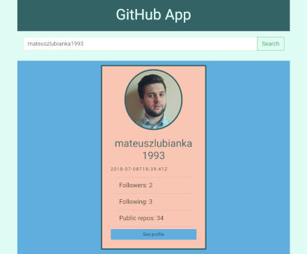

This project was bootstrapped with [Create React App](https://github.com/facebook/create-react-app).

# Search User App
> Hi everyone! This is Search User App. 

## Live
https://mateuszlubianka1993.github.io/github-users-app/

## Technologies:
* React
* Java Script
* HTML5
* CSS 3
* Bootstrap
* Redux
* Axios library
* Redux-thunk

## General info
This is my first app with Redux. 
This is simple Search User App. You can search GitHub users by login.
I used Github API. 

## Screenshots

## Contact
Created by [lubiankamateusz@gmail.com] - feel free to contact me!